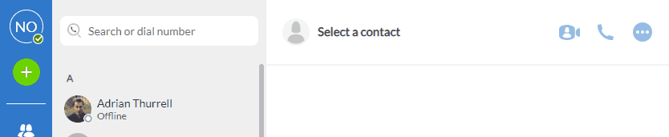

# Banners



Banners are informative texts, like warnings, presented on top of the window.

Some banners may be dismissed, some can't be dismissed at all, it will depend on the goal of the banner.

## Redux

### The redux structure

All the enabled banners are stored in redux store, like so:

```js
  paneManagementReducer: {
    banners: [BannerType.MY_BANNER_TYPE, BannerType.ANOTHER_BANNER],
    ...
  }
```

The `paneManagementReducer.banners` will have all the banners that are not dismissed.

### Redux Actions: Adding a new banner

For adding a new banner on redux store, first, import the following action:

```js
import { addBanner } from "store/action-creators/navigation/actions";
```

Then, dispatch the action like so:

```js
dispatch(
  addBanner(BannerType.MY_BANNER_TYPE)
);
```

This will add the banner to the `paneManagementReducer.banners` array.

### Redux Actions: Removing a banner

For dismissing, or removing a given banner, first, import the following action:

```js
import { removeBanner } from "action-creators/navigation/actions";
```

Then, dispatch the action like so:

```js
dispatch(removeBanner(BannerType.MY_BANNER_TYPE));
```

This will remove the banner from the `paneManagementReducer.banners` array.

## React

### Creating a new banner component

First, you need to add your new banner to the `BannerType` enum:

```js
// store/types.ts
export enum BannerType {
  DND = "dnd",
  MY_BANNER_TYPE = "myBannerType",
}
```

After that, you need to add it to the selector, in the proper priority order you want to:

```js
// store/selectors/paneManagement.ts 
export const selectActiveBanner = (state: StoreState): BannerType | undefined => {
  ...
  } else if (banners.includes(BannerType.MY_BANNER_TYPE)) {
    return BannerType.MY_BANNER_TYPE
  }
  ...
};
```

Then, create a new file at `components/banner` folder with your banner name: `my-banner.tsx`:

```jsx
// Copyright 2021 Metaswitch Networks - Highly Confidential Material
import React from "react";

import { useDispatch } from "react-redux";
import { BannerType } from "shared/types";
import log from "src/renderer-logging";
import { removeBanner } from "action-creators/navigation/actions";

import Banner from "components/ui/Banner";

const MyBanner: React.FC = () => {
  const dispatch = useDispatch();

  const dismissClickHandler = (): void => {
    log.userAction(`Dismissed the MY_BANNER Banner`);
    dispatch(removeBanner(BannerType.MY_BANNER_TYPE));
  };

  return (
    <Banner content="Lorem ipsum..." onDismiss={dismissClickHandler} />
  );
};

export default MyBanner;
```

If you need more instructions on how to create a more customisable banner, use storybook as guidance. Storybook has already some solid examples on how to customise the `Banner` component to fullfill your needs.

### Adding your custom banner to AllBanners component

Before, but not least, you must add your new component to the `components/banner/all-banners.tsx` component, like so:

```jsx
// components/banner/all-banners.tsx
import MyBanner from "./my-banner";
...
  switch (activeBanner) {
    ...
    case BannerType.MY_BANNER_TYPE:
      return <MyBanner />;
...
```

And there you go, now you have your banner working as expected.
