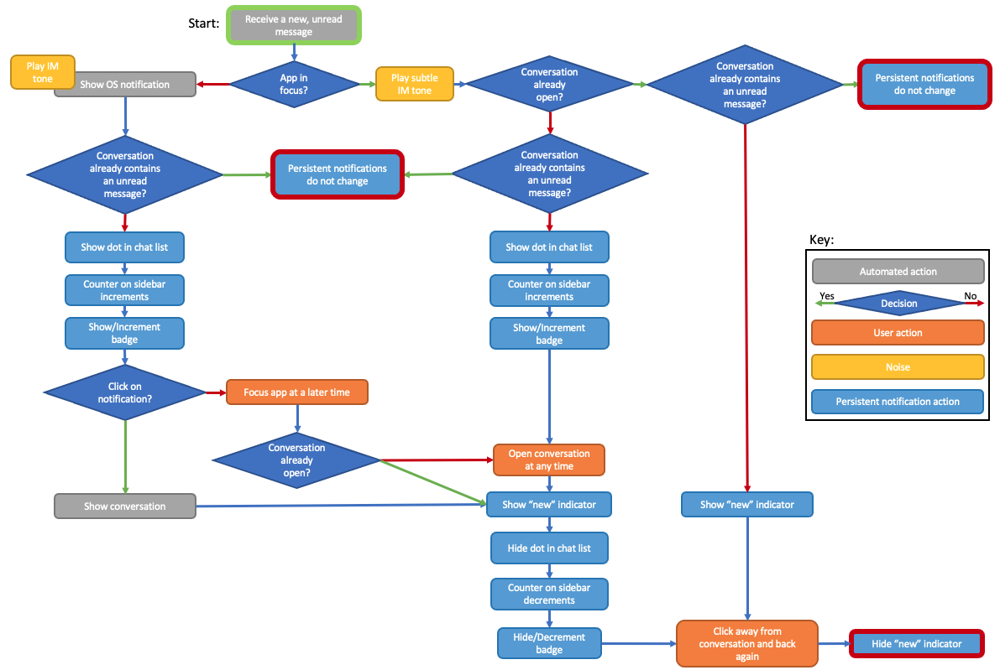

# IM Notifications

We support both pop-up (instant), and persistent IM notifications.

Here is a diagram describing the current behaviour supported by the client:

## Design

### Pop-up OS notification

- When receiving a `DATA` message in the `Messaging` namespace, if the `Chat` data contains a flag `is_new` set to `true`, we have received a new incoming unread message.
- Before updating the Redux store, in `store/action-creators/ipc-incoming/notification-actions.js`, we check whether the app is in focus. If not, we generate an OS notification.
- If the app is in focus, we generate the persistent notifications.

### Attention and Read flags (persistent notifications)

- We use an `attention` flag on the `Chat` object, to mark whether a chat wants attention from the user. If set to `true`, the chat is requesting attention from the user.
- We use a `read` flag on each `ChatMessage` object, to mark whether a chat message has been read by the user. We assume if the most recent message in a chat has been read then all messages in a chat have been read. We also assume that if the most recent message in a conversation is one that has been sent by the user, that all messages in the conversation are read.

### Storing the values

- Java keeps track of a list of chat UIDs which are requesting attention from the user. If not in the list, a chat does not need attention. Java generates this list at start of day, based on whether the latest message in each chat is read or not (attention is set to true if the latest message is not read).
- Java keeps track of whether any chat message is read, and stores this information in a database, in order to persist this information over restart.
- Both `attention` and `read` are stored in Redux within the messaging reducer chats store, and updated when prompted to by incoming `DATA` messages.

### Updating the flags

- Chat pane keeps track of the current selected contact and the previous selected contact.
- On render, if the chat with the selected contact is marked as requesting attention (`attention` set to `true`), and the contact has changed, chat pane dispatches an action to update the `attention` flag to `false`; when the chat with the selected contact is rendered, it satisfies the attention requirement.
- On render, if the previous chats latest incoming message is marked as unread (`read` set to `false`), chat pane dispatches an action to update the `read` flag on the latest incoming message to `true`. We perform this update on the previous chat, as the user must have clicked off the previous chat, and so must have read the messages.
- If the app was not in focus when the chat requested attention, clicking on the pop-up OS notification, or otherwise bringing the app to focus will dispatch an action to set the chat of the selected contact to not require attention.

### Noise

- Playing the noise is controlled in `store/action-creators/ipc-incoming/notification-actions.js`
- If the app is in focus, we don't show the pop-up OS notification, but do play a subtle noise, to inform the user of an imcoming IM message.

### Showing the dot

- We show a dot against a chat in the chat list if the `attention` flag for that chat is set to true. This disappears when the user clicks on the chat to view it.

### Showing the "New" indicator

- We show a "new" indicator above all unread messages in a chat (i.e. the messages have `read` set to `false`). This disappears when the user clicks on then off a chat, having seen the messages.

### Counting the notifications

- We count the number of chats requesting attention (i.e. conversations, not chat messages) in `Sidebar`, and show the number of chats requesting attention against the chat button.
- If a chats `attention` flag changes, then `Sidebar` re-renders and re-calculates the count.
- As we are keeping count of the notifications in `Sidebar`, we also set the taskbar badge/overlay from here.
