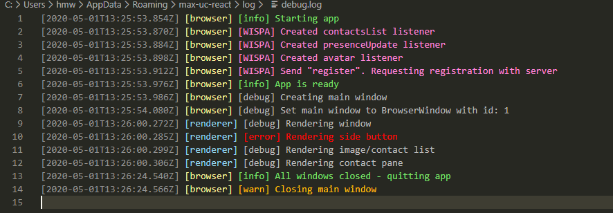

# Introduction

Logging in the refreshed UI uses [electron-log](https://github.com/lonelam/electron-log), a simple open source logging module.

# Generating logs

## Setup

Currently logging config is setup twice, once in the Main process (Node) and once for the Renderer processes (React). This could probably be combined in future, but is not entirely trivial.
The main issue comes from import/export syntax. Electron ships with Node v12 which only supports the `require() + module.exports` syntax and React uses ES6 which only supports the `import + export` syntax. This means we can't have one logging config file, as it would need to export itself in 2 different ways.

Node v12 out in the wild can take a flag to enable ES6 module syntax, however Electron doesn't allow this flag to be passed to its Node process.

This might all be resolved if/when Electron updates to use Node v13, which supports the ES6 syntax. We could also work around this today with Babel.

### Main

Logging is configured in `main-logging.js`. Node code should import it with

```JavaScript
const log = require("node-server/main-logging")
```

### Renderers

Logging is configured in `renderer-logging`. React code should import it with

```JavaScript
import log from "src/renderer-logging"
```

## Usage

Basic usage is the same for Main and Renderer code. The syntax is:

```JavaScript
log.info("Hello world!")
```

There are six main log levels, in order of severity:

```JavaScript
log.error()
log.warn()
log.info()
log.debug()
log.verbose()
log.silly()
```

There are also some custom levels. React has:

```JavaScript
// To log out user actions. These are sent to `user.log` as well as `debug.log`
log.userAction()

// To log out Node-React IPC interactions. These are sent to `api.log` as well as `debug.log`
log.ipc()
```

and in Node:

```JavaScript
// To log out WISPA interactions. These are sent to `wispa.log` as well as `debug.log`
log.wispa()

// To log out Node-React IPC interactions. These are sent to `api.log` as well as `debug.log`
log.ipc()
```

## Further configuration

To change the logging infrastructure, refer to the [electron-log README](https://github.com/lonelam/electron-log/blob/master/README.md) and the [docs](https://github.com/lonelam/electron-log/tree/master/docs) it links to.

# Consuming logs

The logging is configured to write to console and to file.

## Console

Logs from the Main process will write to the application console. Logs from the Renderer processes will write to the Browser console. Note that to see logs below info in the Browser console you need to click the "show console sidebar" button and select "Messages".

## File

The logging directory on Windows is:

```
%USERPROFILE%\AppData\Roaming\\max_uc_react\\log\\
```

and on Mac is:

```
~/Library/Logs/max_uc_react/
```

There are three log files:

- debug.log - All logs are written here
- user.log - userAction and error logs are written here
- api.log - WISPA, IPC, and error logs are written here
- wispa.log - WISPA and error logs are written here

Editors can automatically colour `.log` files. To set this up on VS Code install the extension [`Log file highlighter`](https://github.com/emilast/vscode-logfile-highlighter). You may want to configure custom colouring as the default colour scheme can lead to surprising results (e.g. `error` being green). Here's an example to add to your `settings.json`

```json
    "logFileHighlighter.customPatterns": [
        {
            // Timestamp
            "pattern": "^\\[.*\\Z]",
            "foreground": "#949494" // Grey
        },
        {
            // Browser process marker
            "pattern": "\\[browser\\]",
            "foreground": "#f5f19f" // Pale yellow
        },
        {
            // Renderer process marker
            "pattern": "\\[renderer\\]",
            "foreground": "#97d7f0" // Pale blue
        },
        {
            // Error level marker and log text
            "pattern": "\\[error\\] .*",
            "foreground": "#ff0000" // Red
        },
        {
            // Warn level marker and log text
            "pattern": "\\[warn\\] .*",
            "foreground": "#ffbf00" // Amber
        },
        {
            // Info level marker and log text
            "pattern": "\\[info\\] .*",
            "foreground": "#7de06c" // Green
        },
        {
            // Debug level marker and log text
            "pattern": "\\[debug\\] .*",
            "foreground": "#bcbcbc" // Pale grey
        },
        {
            // WISPA level marker and log text
            "pattern": "\\[WISPA\\] .*",
            "foreground": "#ff87d7" // Pale pink
        },
        {
            // WISPA level marker and log text
            "pattern": "\\[IPC\\] .*",
            "foreground": "#ff87d7" // Pale pink
        },
    ],
```

Which produces:


