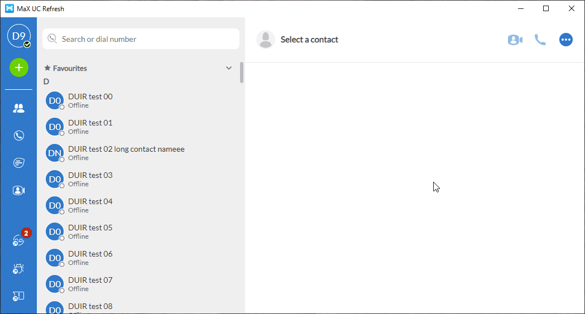

# Storybook

## Introduction

Storybook is a tool which allow us to document our code in what is called "stories".

A story, under storybook terms, is a given React component being rendered in a given state.

We can document small and individual components, targeting the reusability of those components.

And we can document entire pages, with complex states, and dozen of components forming it as a whole.

To run storybook, you don't need to have your real application running, as it renders the components with "mocked" states.

You can as well, change the props or states on the fly, just to test how that working component, will render with a different set of props.

## How to run storybook

Run the following command in the terminal:

```
npm run storybook
```

After a minute or so, it should open new browser window, with storybook running on http://localhost:6006

## How to write a storybook story

Imagine we have the following component:

```jsx
// src/dummyButton.tsx
import React from "react";
import { useSelector, useDispatch } from "react-redux";

import { StoreState } from "store/types";
import * as S from "./styles";

export enum DummyButtonStyleEnum {
  primary = "primary",
  secondary = "secondary",
};

export interface DummyButtonProps {
  label: string;
  btnStyle?: DummyButtonStyleEnum;
};

const DummyButton: React.FC<DummyButtonProps> = ({
  label,
  btnStyle = DummyButtonStyleEnum.primary,
}) => {
  const dispatch = useDispatch();
  const disabled = useSelector<StoreState, boolean>(
    (state) => state.dummyReducer.disabled
  );

  const onClick = () => dispatch({ type: "DUMMY_BUTTON_CLICKED" });

  return (
    <S.Button btnStyle={btnStyle} disabled={disabled}>
      {label}
    </S.Button>
  );
};
```

For creating a storybook story for that, create a new file sitting next to it, named like `dummyButton.stories.tsx` and write it like this:

```jsx
// src/dummyButton.stories.tsx
import React from "react";
import { Story, Meta } from "@storybook/react";
import { reduxStoreDecorator } from "store/storybook-redux-store";

import DummyButton, {
  DummyButtonStyleEnum,
  DummyButtonProps,
} from "./dummyButton";

export default {
  title: "Components/DummyButton",
  component: DummyButton,
} as Meta;

const Template: Story<DummyButtonProps> = (args) => <DummyButton {...args} />;

// Template.bind({}) is necessary, so that storybook
// allows you to override the props in real time
export const PrimaryButton = Template.bind({});

// The args are the props passed to our story component
PrimaryButton.args = {
  label: "Save",
};

// Decorators are wrappers in which our component is rendered inside
PrimaryButton.decorators = [
  // The reduxStoreDecorator, simulate a giving state of redux
  reduxStoreDecorator({
    dummyReducer: {
      disabled: false,
    },
  }),
];

export const SecondaryButton = Template.bind({});
SecondaryButton.args = {
  label: "Cancel",
  btnStyle: DummyButtonStyleEnum.secondary,
};
SecondaryButton.decorators = [
  // You can re-use other stories decorators
  ...PrimaryButton.decorators
];

// Each exported variable with `Template.bind({})` is handle as a new "story"
// Which means this file has 3 stories:
//   1st: PrimaryButton
//   2nd: SecondaryButton
//   3rd: DisabledButton
export const DisabledButton = Template.bind({});
DisabledButton.args = {
  // And you can re-use other stories args as well
  ...SecondaryButton.args,
};
DisabledButton.decorators = [
  reduxStoreDecorator({
    dummyReducer: {
      disabled: true,
    },
  }),
];

```

## Creating stories for whole screen

You can easily create a story for the whole screen, using a dump of a current state of redux.

For doing that, follow this instruction here:

1. Run the app locally at Richmond (otherwise, it would expose your personal data and messages!)
2. On electron ui, open dev tools and go to the redux dev tools
3. Click on State tab
4. Click in the raw button
5. Copy them all
6. Create a new .ts file inside src/shared/redux-dumps and paste your content there, exporting it as default
7. Convert enums from string to its enum variant



Then, add a new story to the file `src/components/windows/MainWindow.stories.tsx`.

## Storybook Workflow: creating a new component

1. Imagine that you need to create a new react component for your task. For example, a skeumorphic dial. Then, start creating an empty component, including an export with the planned props for it:

```jsx
// src/<somewhere>/skeumorphic-dial.tsx
import React from "react";

export interface SkeumorphicDialProps {
  value?: string;
  // and so on
};

const SkeumorphicDial: React.FC<SkeumorphicDialProps> = () => null;

export default SkeumorphicDial;
```

2. Then create a file for the stories of this new component:

```jsx
// src/<somewhere>/skeumorphic-dial.stories.tsx
import React from "react";
import { Story, Meta } from "@storybook/react";

import SkeumorphicDial, { SkeumorphicDialProps } from "./skeumorphic-dial";

export default {
  title: "Components/SkeumorphicDial",
  component: SkeumorphicDial,
} as Meta;

const Template: Story<SkeumorphicDialProps> = (args) => <DummyButton {...args} />;
```

The above is the boiler plate for any story you will create.

3. Now, create the stories you are planning for this new component:

```jsx
// src/<somewhere>/skeumorphic-dial.stories.tsx
...
const Template: Story<SkeumorphicDialProps> = (args) => <DummyButton {...args} />;

export const EmptyState = Template.bind({});
EmptyState.args = {
  value: "",
};

export const EmergencyNumber = Template.bind({});
EmergencyNumber.args = {
  value: "999",
};

// And so on ...
```

4. Now, start coding your component, and as soon as you save, you will see it reflect automatically (it automatically refresh the page) with the current state of your component.

5. And with that, you have implemented your component using TDD without even knowing anything about TDD.

## Storybook Workflow: updating a component

1. If their is not story set for the component your are going to change, write the stories for it before starting your real code.

2. Create a new story for the new state you are making to the component. Imagine you are adding a new prop or wiring it with a new redux variable (useSelector). Then create a new story to cover all the possible visual changes with these props or redux state. Example:

```jsx
export const ButtonWithIcon = Template.bind({});
ButtonWithIcon.args = {
  ...MyBaseStory.args,
  icon: MyIcon,
};
```

3. As soon as you save this story, Storybook will automatically refresh and create it for you.

4. But, as the component is not changed yet, you will not see your component change appearing at Storybook.

5. Now, you can make the changes in your component, and as soon as you save the component, you should see the changes reflecting into Storybook.
