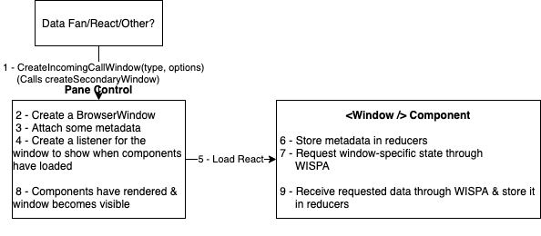

# Window creation

This doc covers the design for how the app creates new windows.

Summary of the flow:

In a little more detail:

0. Pane Control exposes an API for creating various types of window through `createMainWindow` and `createIncomingCallWindow`

   - `createIncomingCallWindow` calls the `createSecondaryWindow` function which actually instantiates the new window. This function will be reusable for different types of windows in the future. (e.g. a chat window with Alice or an incoming call window prompted by George calling)

1. This API is called by whoever - they provide key data for the creation of the window (e.g. Alice's IMAddress and the 'type' of window that should be created). The values that determine window size, resizeability, whether we want the window to have a frame (i.e. a topbar with a close/minimize button) etc, are hardcoded based on the type of window we want to create, for example we want a non-resizable small window for an incoming call window.

2. Pane Control creates a new `BrowserWindow`

3. Pane Control attaches the window type and key data to the `BrowserWindow` as `metadata`.

4. Pane Control loads the React URL into the window

   - Note this is _always the same URL_ regardless of window type. The React app conditionally renders different window content based on the type passed in through `metadata`

5. Immediately on startup, the window metadata is stored in every single reducer

   - This is done so that incoming IPC signals, which trigger reducer case-statements, only go through when it concerns the correct window. For instance, when a DATA chatMessage signal comes in on the IncomingCallWindow, the reducer handler will check the type stored in metadata and then immediately return without doing any further computation. This prevents us from doing unneeded computation for windows that don't require that specific piece of state.

6. The React 'window' component immediately requests all state that's relevant to that particular type of window from WISPA

   - ATM this causes all data to be sent to all windows - there's a real risk this will cause perf issues as it clogs up IPC. In future we may need to reduce it by either requesting specific data or filtering it in Data Fan. For now, the performance hit on every individual window is reduced by only doing further computation based on the incoming signal when the incoming data is actually relevant to the window (as described above)

7. Only when the new window has rendered content for the first time does the secondary window actually show up for the user. The windows visibility is initialized as false to prevent a completely empty white window showing up before the user can interact with it (i.e. bad UX)

   - This is done in `/pane-control.js`, under `secWindow.webContents.on("did-finish-load")`. Testing has proved that this is the very last 'phase' the Electron window goes through before being considered fully 'ready'. Without invoking `"did-finish-load"`, users will be shown with an empty white window.

8. While the window is visible, all the requested data might not yet have been returned by WISPA. React therefore waits for its Redux store to be fully populated (as with a normal window). In the meantime, the window is usable for the user though we might have to provide some placeholders to make for better UI.
