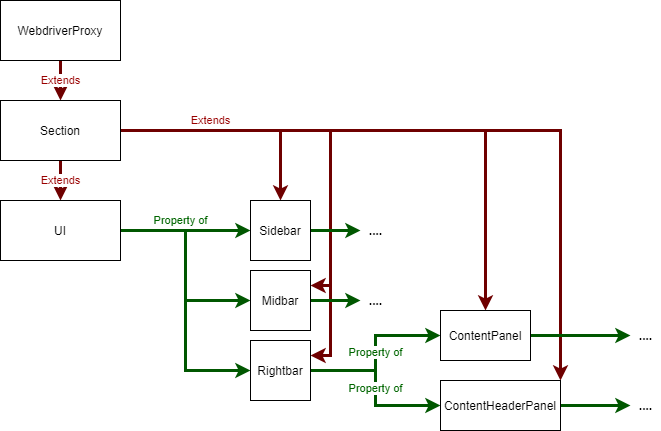

# UI Interface

Provides the UI interface used by the FV framework

It is recommended to read `electron-fv-readme.md` before making changes here. That will give details on how this fits into the HLD and how Spectron/Webdriver works.

## Design

Here is a summary of the design, starting from the top and drilling down.

This module exports only the `init()` function, which is responsible for constructing the object that represents the UI object, called `UI`, given the Spectron Application object, called `app`.

There are three stages to this:

1. Construct a `WebdriverProxy` class to act as a base class. This proxies any webdriver methods that are called on it to the webdriver instance provided by Spectron under `app.client`. It also fills in any information needed to call these methods, such as an Xpath or ElementId.
2. Define a `Section` class. This is an abstract class that represents a given section of the UI (e.g. the content header panel). It houses the xpath to that section
3. Define the various sections of the UI we're interested in as extensions of `Section` and give them any custom methods we wish to call on them (e.g. `messageBox.sendMessage()`). Some of these sections may have "child" sections as properties. These child sections _do not inherit from the parent section_, rather they are their own `Section` which is attached to the parent in its constructor (e.g. `this.contentPanel = new ContentPanel()` in `Rightbar`'s constructor). This allows child components to be accessed by "drilling down" through the UI. For example, the content panel would be accessed with `UI.rightbar.contentPanel`.

This diagram shows the relationships between the different objects



## Adding functionality

If you want to add functionality to the UI interface that probably involves either adding a new `Section` or adding a method to an existing `Section`.

### Adding a new Section

To add a new Section:

- Decide which current Section should be its parent
- Determine its XPath. This may involve adding an `id` to the relevant HTML element in the code, or, for Sections that are unlikely to move around relative to their parent, you can not add an Id. Its xpath will then be relative to its closest parent which _does_ have an id. Either way you can determine the elements Xpath by using the devtools in the live app and [following these steps](https://dev.to/tonetheman/xpath-locators-with-chrome-devtools-4fb5).
- Create a new class extending `Section`
- Add its xpath in the constructor

E.g.

```js
class MyNewSection extends Section {
  constructor() {
    super();
    this.xpath = "my-new-sections-xpath";
  }

  coolMethod1() {
    //do stuff
  }
}

// ...

class PreExistingParentSection extends Section {
  constructor() {
    super();
    this.xpath = "pre-existing-parent-xpath";
    this.myNewSection = new MyNewSection(); // Add this line
  }
}
```

## Usage

The goal of this is to make tests concise and readable. Most usage involves drilling down through the UI to the section you want, then calling a Webdriver or Section-specific method.

**Example 1 - Simple usage**

```JavaScript
expect(await UI.midbar.chatList.isVisible()).toBe(false);

UI.sidebar.chatsButton.click();
await UI.midbar.chatList.waitForVisible();

expect(await UI.midbar.chatList.isVisible()).toBe(true);
```

**Example 2 - More complex usage**

```JavaScript
const [bilboButton, gandalfButton] = await UI.midbar.contactList.contacts();
gandalfButton.click()

const contentPanelName =  await UI.rightbar.contentHeaderPanel.contact().then((contact) => {
  return contact.name;
});
expect(contentPanelName).toBe("Gandalf the Grey")
```

It is recommended to read through the [UI interface code](./ui-interface.js) to see:

- What Sections are defined
- What methods they have on them that you may find useful

When adding new tests it is expected that you'll need to add new Sections or new methods on existing ones to make your life easier, don't be afraid to do so!
